# @use-raf/state

A React hook that synchronizes state updates with `requestAnimationFrame` for optimal rendering performance.

## Installation

```bash
npm install @use-raf/state
```

## Usage

```tsx
import { useRafState } from '@use-raf/state'

const Demo = () => {
  const [count, setCount] = useRafState(0)

  return (
    <div>
      <p>Count: {count}</p>
      <button onClick={() => setCount(count + 1)}>Increment</button>
      <button onClick={() => setCount(prev => prev - 1)}>Decrement</button>
    </div>
  )
}
```

High-frequency updates example:

```tsx
const Demo = () => {
  const [position, setPosition] = useRafState({ x: 0, y: 0 })

  const handleMouseMove = (e: MouseEvent) => {
    // Updates are automatically batched to the next frame
    setPosition({ x: e.clientX, y: e.clientY })
  }

  return (
    <div onMouseMove={handleMouseMove}>
      <p>Position: {position.x}, {position.y}</p>
    </div>
  )
}
```

## API

### `useRafState<S>(initialState?)`

**Parameters:**

- `initialState: S | (() => S)` - Initial state value or lazy initializer function

**Returns:**

- `[state, setState]` - Current state and setter function (identical to `useState` API)

**Note:** When multiple updater functions are called between frames (e.g., `setState(prev => prev + 1)` three times), `@use-raf/state` correctly chains them, resulting in `3`, while other implementations (`@shined/react-use`, `react-use`, `@reactuses/core`) only apply the last update, resulting in `1`. See [the trial test case](./src/state.test.ts:#L367-L410):

```bash
bun run test:trial
```

Another example illustrating this behavior:

```ts
const [count, setCount] = useRafState(0)

const double = useCallback(() => {
  setCount(v => v + 1)
  setCount(v => v + 1)
}, [])
```



```mermaid
flowchart LR
    F1["..."] --> F2["setState(1)"]
    F2 --> F3["..."]
    F3 --> RP1["Repaint (state = 1)"]
    RP1 --> F4["..."]
    F4 --> F5["setState(v =&gt; v + 1)"]
    F5 --> F6["setState(v =&gt; v + 1)"]
    F6 --> F7["..."]
    F7 --> RP2["Repaint (state = 3)"]
    RP2 --> F8["..."]

    subgraph DoubleCallback["double callback"]
        F5
        F6
    end

    style F1 fill:#cccccc,stroke:#888,stroke-width:2px,color:#000
    style F2 fill:#cccccc,stroke:#888,stroke-width:2px,color:#000
    style F3 fill:#cccccc,stroke:#888,stroke-width:2px,color:#000
    style RP1 fill:#4A90E2,stroke:#07c,stroke-width:3px,color:#fff
    style F4 fill:#cccccc,stroke:#888,stroke-width:2px,color:#000
    style F5 fill:#cccccc,stroke:#888,stroke-width:2px,color:#000
    style F6 fill:#cccccc,stroke:#888,stroke-width:2px,color:#000
    style F7 fill:#cccccc,stroke:#888,stroke-width:2px,color:#000
    style RP2 fill:#4A90E2,stroke:#07c,stroke-width:3px,color:#fff
    style F8 fill:#cccccc,stroke:#888,stroke-width:2px,color:#000
    style DoubleCallback fill:#9B8CF5,stroke:#6C5CDC,stroke-width:3px,color:#fff
```

| Package | Result |
|---------|--------|
| `@use-raf/state` | ✅ `3` |
| `@shined/react-use` | ❌ `1` |
| `react-use` | ❌ `1` |
| `@reactuses/core` | ❌ `1` |

## Performance

Benchmarked against similar hooks from popular libraries. While `react-use` leads in all scenarios, `@use-raf/state` remains competitive with both the best-performing `react-use` and `@shined/react-use`, slightly outperforming the latter across throughput tests.

### Benchmark Results

| Test | @use-raf/state | react-use | @shined/react-use | @reactuses/core |
|------|----------------|-----------|-------------------|-----------------|
| Mount cost (hz) | 14,694.06 | **16,423.23** | 15,427.73 | 16,121.82 |
| Single update/frame (hz) | 168.83 | **174.01** | 154.90 | 48.59 |
| Batched updates (hz) | 480.80 | **516.77** | 499.28 | 282.33 |
| Updater functions (hz) | 164.54 | **170.44** | 148.11 | 48.31 |
| Complex state (hz) | 274.43 | **283.95** | 252.28 | 93.99 |

*Higher hz values indicate better performance. Bold values represent the best result for each test.*

**Hardware:** Apple M2 Max (12 cores @ 3.50 GHz), 32 GB RAM

**Running benchmarks:**

```bash
bun run bench
```

**Performance regression tracking:** benchmark results are continuously monitored via [CodSpeed][codspeed-link] to detect performance regressions.

<!--links:start-->
[codspeed-link]: https://codspeed.io/einouqo/use-raf
<!--links:end-->
